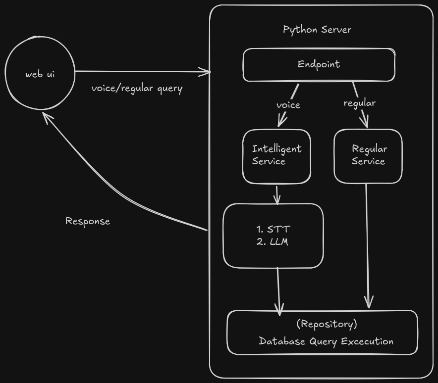

# VoiceQuest

**Manage tasks, Hands free**

A Task management app which lets you schedule, reschedule, complete and cancel task just by using natural language voice. It uses ElevenLabs API for speech to text transcription and openweight mistral model for intent parsing.

It uses SQLite3 as primary database so users can easily just clone this and start running this app without having to setup database.

## App Flow



## Setup Instructions

### Prerequisites

- Python 3.10+
- Node.js 18+ and npm (for the web folder)
- `uv` (recommended)

---

- **Create `.env` file in this root folder**

```env
# JWT Secret — generate with:
# openssl rand -hex 32
SECRET_KEY=your_generated_secret_here

# Mistral AI API Key
# Get it from: https://console.mistral.ai/api-keys
MISTRAL_API_KEY=your_mistral_api_key_here

# ElevenLabs API Key
# Get it from: https://elevenlabs.io/app/developers/api-keys
ELEVENLABS_API_KEY=your_elevenlabs_api_key_here
```

### Docker

If you prefer docker maksure `.env` file has all the keys before building.

```bash
docker compose up --build
```

### Python Setup

#### Option A: Using `uv` (Recommended)

1. **Install uv** (if not already installed):

```bash
   curl -LsSf https://astral.sh/uv/install.sh | sh
```

2. **Create and activate virtual environment:**

```bash
   uv venv
   source .venv/bin/activate        # macOS/Linux
   .venv\Scripts\activate           # Windows
```

3. **Install dependencies:**

```bash
   uv sync
```

- After activating `.venv` run this command to start a uvicorn server

```bash
fastapi dev
```

- An SQlite3 Database file `voicequest.db` will be automatically created the current folder.

---

#### Option B: Using `pip`

1. **Create and activate virtual environment:**

```bash
   python -m venv .venv
   source .venv/bin/activate        # macOS/Linux
   .venv\Scripts\activate           # Windows
```

2. **Install dependencies:**

```bash
   pip install -r requirements.txt
```

> **Note:** If a `requirements.txt` doesn't exist, you can generate one from the uv lockfile:
>
> ```bash
> uv export --format requirements-txt > requirements.txt
> ```

---

### Web Setup

### Production Server (serves ui from the same fastapi server)

```bash
cd web
npm install
npm run build
```

```bash
cd ../
fastapi dev
```

- Serves SPA on `/`

### Development Server

1. **Navigate to the web folder:**

```bash
   cd web
```

2. **Install dependencies:**

```bash
   npm install
```

3. **Start the development server:**

```bash
   npm run dev
```
